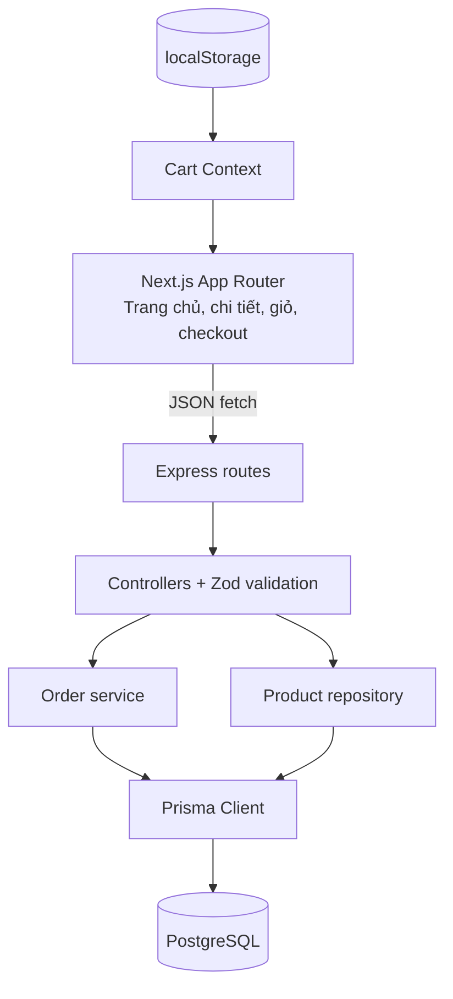

# Kiến trúc MiniShop

## Tổng quan

Ứng dụng gồm hai tiến trình cục bộ. Next.js chạy trên cổng `3000` và gọi REST API ở `4000` qua `NEXT_PUBLIC_API_URL`. API dùng Express routes, controllers, services và repositories; Prisma quản lý truy vấn tới PostgreSQL. Ảnh SVG nằm trong `frontend/public/products`, không cần dịch vụ ảnh bên ngoài.

## Biên trách nhiệm

- `frontend/src/app`: trang App Router; `components` chứa các thành phần trình bày; `store/cart.tsx` quản lý giỏ và phục hồi localStorage sau hydration.
- `backend/src/routes`: ánh xạ endpoint; controllers xác thực đầu vào, services áp dụng quy tắc đơn hàng, repositories truy vấn danh mục/sản phẩm.
- `backend/prisma`: schema, migration SQL và seed upsert theo slug.
- API không tin giá do client gửi. Tổng tiền dùng `Prisma.Decimal`; hàng tồn được giảm bằng cập nhật có điều kiện trong transaction serializable.
- Đơn được tra cứu bằng token ngẫu nhiên 256 bit. Chỉ hash token được lưu; endpoint trả 404 nếu token sai hoặc không có.

## Mô hình dữ liệu

`Category 1—N Product`, `Order 1—N OrderItem`, `Product 1—N OrderItem`. Giá dùng `DECIMAL(10,2)`, UUID làm khóa chính, slug được unique. Check constraints bảo đảm giá/kho không âm và số lượng mua lớn hơn 0. Không có tài khoản hoặc thanh toán trong MVP.
